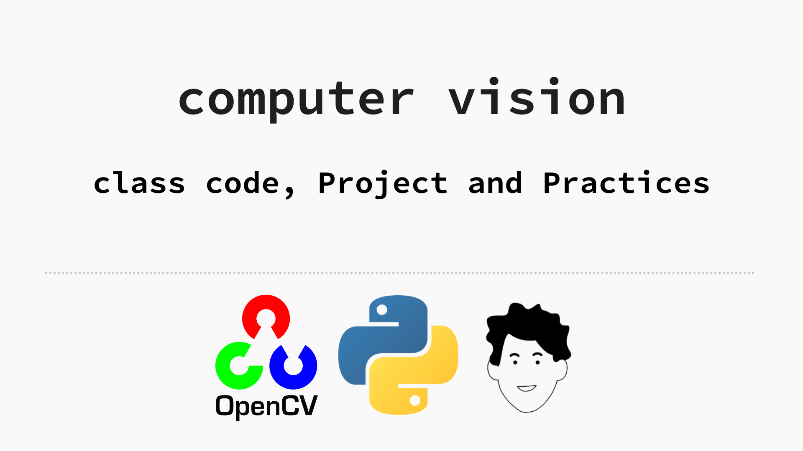

# Computer Vison With Python and opencv  - Spring 2021 
## Class Code, Projects and Practices
## Sirjan Tech University
## Teacher: Elham Shabaninia

---
# Sessions:

## [Session 1 opencv](notebooks/session_1.md)
## [Session 1 opencv NoteBook](notebooks/session_1.ipynb)
### [slides ***session_2.pdf***](slides/session_2.pdf)
#### Topics:
- [anaconda env](https://docs.conda.io/projects/conda/en/latest/user-guide/tasks/manage-environments.html)
    - create anaconda env
    - activate anaconda env
- import cv2
    - [install opencv with pip](https://pypi.org/project/opencv-python/)
- read image file
    - [doc](https://opencv-python-tutroals.readthedocs.io/en/latest/py_tutorials/py_gui/py_image_display/py_image_display.html)
- show variable's value in Spyder IDE    
- show image in window with opencv
- save image with opencv
- solve qustion 1 : **Read Image and show it in Windows when user press 's' save it in 'messigray.png' file  if  press 'ESC' exit**
- Get webcam as inut and render in opencv window
- resize image
    - fixed size
    - relative size
- flip image

----

## [Session 2 opencv](notebooks/session_2.md)
## [Session 2 opencv NoteBook](notebooks/session_2.ipynb)
### [slides ***session_2.pdf***](slides/session_2.pdf)
#### Topics:

- Qustion 1: add two image
    - [concat them with `cv2.vconcat()` and `cv2.hconcat()`](notebooks/session_2.md#concat-theme-with:)
    - [add with `cv2.add()` function](notebooks/session_2.md#add-two-image-with-cv.add())
- [Add Two image with different size](notebooks/session_2.md#Add-Two-image-with-different-size)
- [Add two image with different transparency](notebooks/session_2.md#add-two-image-with-different-transparency)
- [Other image opration in OpenCV](notebooks/session_2.md#other-image-opration)
- **[Qustion 2 : Add image to Top Left of other image](#Qustion-2-:-Add-image-to-Top-Left-of-other-image)**

- [Add Rain Effect in to your webcam Stream](notebooks/session_2.md#Add-Rain-Effect-in-to-your-webcam-Stream)

## [Session 3 opencv](notebooks/session_3.md)
## [Session 3 opencv NoteBook](notebooks/session_3.ipynb)
### [slides ***session_3.pdf***](slides/session_3.pdf)
#### Topics:
- [Qustion 1](notebooks/session_3.md#Qustion-1):search about `cv2.cvtColor` and `cv2.threshold`
    - [Python OpenCV | cv2.cvtColor() method](https://www.geeksforgeeks.org/python-opencv-cv2-cvtcolor-method/)
    - [Image Thresholding - cv2.threshold](https://docs.opencv.org/master/d7/d4d/tutorial_py_thresholding.html)
- cv.threshold
- Draw in image
- MASK in opencv
----

## [Session 4 opencv](notebooks/session_4.md)
## [Session 4 opencv NoteBook](notebooks/session_4.ipynb)
### [slides ***session_3.pdf***](slides/session_3.pdf)
#### Topics:
- [Qustion 1](notebooks/session_4.md#Qustion-1):RGB, HSV and CMYK
    - [CMYK and RGB? HSV and HSL? Introducing the Chromatic Compendium!](https://dev.to/r4h33m/cmyk-and-rgb-hsv-and-hsl-introducing-the-chromatic-compendium-1d7)
- [Filter Images](notebooks/session_4.md#Filter-Images)
    - why we use fillters? for local process like delete noise with average fillter
- [Types of Convolution Kernels](https://towardsdatascience.com/types-of-convolution-kernels-simplified-f040cb307c37)
- make image blur

## [Session 5 opencv](notebooks/session_5.md)
## [Session 5 opencv NoteBook](notebooks/session_5.ipynb)
### [slides ***session_3.pdf***](slides/session_3.pdf)
#### Topics:
- project and add store text for ocr
- Fliter Images recap
- [Image Gradients](notebooks/session_5.md#Image-Gradients)
    - [gradients doc](https://opencv-python-tutroals.readthedocs.io/en/latest/py_tutorials/py_imgproc/py_gradients/py_gradients.html)
- [Canny edge detection algorithm](notebooks/session_5.md#Canny-edge-detection-algorithm)
    - [Doc](https://opencv-python-tutroals.readthedocs.io/en/latest/py_tutorials/py_imgproc/py_canny/py_canny.html)

