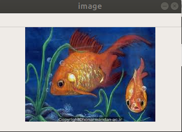
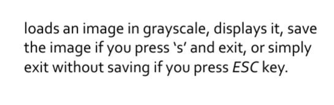
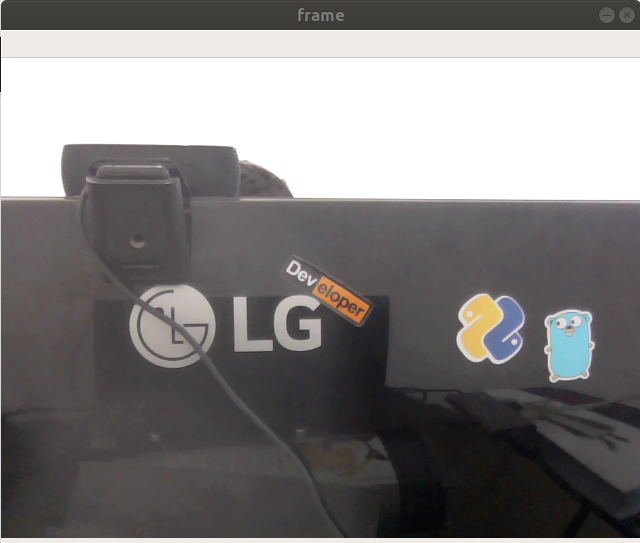
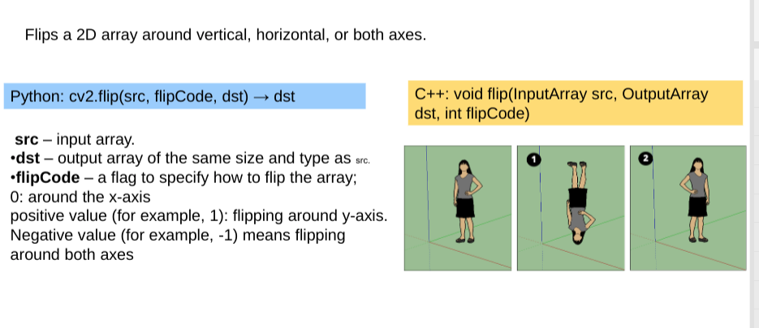

# topics:

- [anaconda env](https://docs.conda.io/projects/conda/en/latest/user-guide/tasks/manage-environments.html)
    - create anaconda env
    - activate anaconda env
- import cv2
    - [install opencv with pip](https://pypi.org/project/opencv-python/)
- read image file
    - [doc](https://opencv-python-tutroals.readthedocs.io/en/latest/py_tutorials/py_gui/py_image_display/py_image_display.html)
- show variable's value in Spyder IDE    
- show image in window with opencv
- save image with opencv
- solve qustion 1 : **Read Image and show it in Windows when user press 's' save it in 'messigray.png' file  if  press 'ESC' exit**
- Get webcam as inut and render in opencv window
- resize image
    - fixed size
    - relative size
- flip image


```python
import cv2
```

## Read image file in opencv


from `session_1/fish.jpeg`


```python
# read image
file_name = 'session_1/fish.jpeg'
img = cv2.imread(file_name)
```

## open with window



```python
# create window and show it
cv2.imshow('image',img)
# wait unitl user enter some key when window selected
cv2.waitKey(0) # get time if set 0 then wait until press key
# close all windows
cv2.destroyAllWindows()
```

# save image with `cv2.imwrite(file_path, img)`
- change ext
- save changed image


```python
cv2.imwrite('saved_image.png',img)
```


    True


```python
%ls
```

    README.md  saved_image.png  session_1/  session_1.ipynb  video.mp4


# read other image


from `session_1/opencv.jpeg`


```python
file_name = 'session_1/opencv.jpeg'
img = cv2.imread(file_name)
cv2.imshow('image',img)
cv2.waitKey(0)
cv2.destroyAllWindows()
```

# question


### ord(str) function : convert entered char to ASCI code
like:
```python

>> ord('s')
115
```


### chr(int) function : convert entered ACSI to char
like:
```python

>> chr(27)
'\x1b'
```


```python
def question_1(file_path: str ) -> None:
    """ Read Image and show it in Windows when user press 's' save it in 'messigray.png' file 
        if  press 'ESC' exit
        
        Parameters
        ----------
        file_path : str
            image file path
    
    """
    img = cv2.imread(file_path, 0) # zero for grayscale read
    cv2.imshow('image',img)
    entered_key = cv2.waitKey(0)
    
    if entered_key == ord('\x1b'):
        cv2.destroyAllWindows()
        
    elif entered_key == ord('s') :
        cv2.imwrite('messigray.png',img)
        cv2.destroyAllWindows()
        
     cv2.destroyAllWindows()
        
file_path = 'session_1/fish.jpeg'

question_1(file_path)
```

# input webcam into 




```python
import cv2
# get webcam with id 0 (in my case I have 2 webcam)
cap = cv2.VideoCapture(0)


while True:
    # Capture frame-by-frame
    ret, frame = cap.read()

    if not ret:
        break
    else: 
        # show each frame in window
        cv2.imshow("frame", frame)
        
    # if user entered any key break while 
    entered_key = cv2.waitKey(5)
    if entered_key > 0:
        break
        
# after while close webcam and opencv window  
cap.release()
cv2.destroyAllWindows()
```

# read video with `cv2.VideoCapture()` function
**read from webcam or from video file**

`cv2.VideoCapture(webcam_id : int)` or `cv2.VideoCapture(file_path : str)`


# save (write video) with cv2.VideoWriter()


#### practice:
***Get Your video and save it in your system***

#### practice Solve:


```python
# Edit Image
```


```python
file_name = 'session_1/opencv.jpeg'
img = cv2.imread(file_name,0)
# get image shape

img.shape
```


    (184, 150)


```python
img.dtype
```


    dtype('uint8')


## resize function


```python
# resize with fixed size
resized_image = cv2.resize(img, (552, 450))
cv2.imshow('image',resized_image)
cv2.waitKey(0)
cv2.destroyAllWindows()
```


```python
import cv2
# resize with relative size 
file_name = 'session_1/fish.jpeg'
img = cv2.imread(file_name)
# witdt * 0.25  and height * 0.5
resized_image = cv2.resize(img, (0, 0) ,None, 0.25, 0.5)
cv2.imshow('image',resized_image)
cv2.waitKey(0)
cv2.destroyAllWindows()
```

# Use Numpy


```python
import numpy as np
```

# flip image



