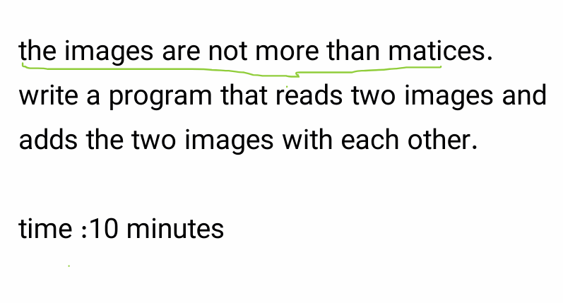
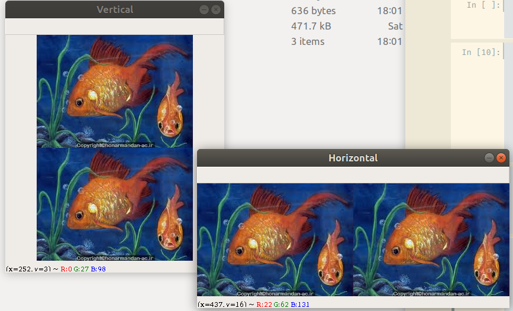
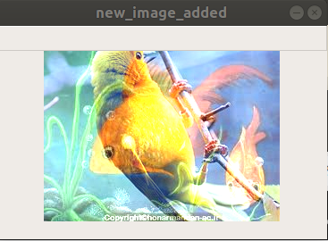
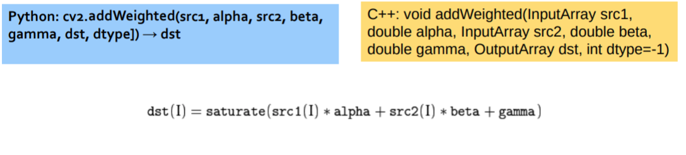
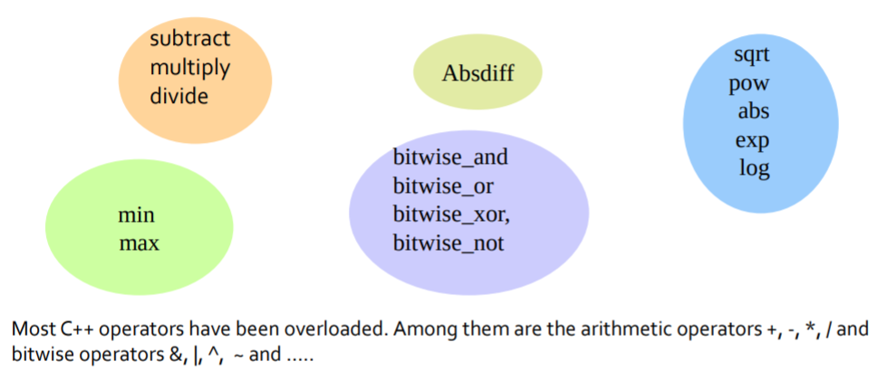
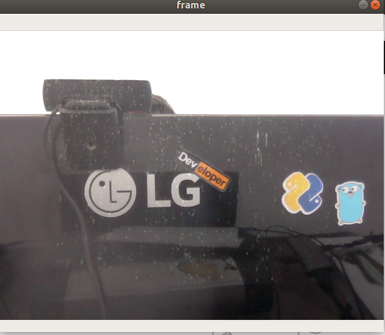

# topics:

- Qustion 1: add two image
    - [concat them with `cv2.vconcat()` and `cv2.hconcat()`](##concat-theme-with:)
    - [add with `cv2.add()` function](#add-two-image-with-cv.add())
- [Add Two image with different size](#Add-Two-image-with-different-size)
- [Add two image with different transparency](#add-two-image-with-different-transparency)
- [Other image opration in OpenCV](#other-image-opration)
- **[Qustion 2 : Add image to Top Left of other image](#Qustion-2-:-Add-image-to-Top-Left-of-other-image)**

- [Add Rain Effect in to your webcam Stream](#Add-Rain-Effect-in-to-your-webcam-Stream)


```python
import cv2
import numpy as np
```

# qustion 1


---

## concat theme with:

To stack vertically (img1 over img2):
```python
v_img = cv2.vconcat([img_1, img_2])
```

To stack horizontally (img1 to the left of img2):
```python
h_img = cv2.hconcat([img_1, img_2])
```
**[more info](https://stackoverflow.com/questions/7589012/combining-two-images-with-opencv)**

**read image**


```python
file_1_name , file_2_name = 'session_2/fish.jpeg' , 'session_2/sample_imge.jpeg'
img_1 = cv2.imread(file_1_name)
img_2 = cv2.imread(file_2_name)
```

**concat images**


```python
v_img = cv2.vconcat([img_1, img_1])
h_img = cv2.hconcat([img_1, img_1])
```

**show in 2 windows**


```python
cv2.imshow('Horizontal', h_img)
cv2.imshow('Vertical', v_img)
cv2.waitKey(0)
cv2.destroyAllWindows()
```

## add two image with `cv.add()`


`cv2.add(src1, src2, dst, mask, dtype) → dst`


```python
new_image_added = cv2.add(img_1,img_2)
```


```python
cv2.imshow('new_image_added', new_image_added)
cv2.waitKey(0)
cv2.destroyAllWindows()
```

## Add Two image with different size
**if two image not same size**


```python
file_1_name , file_2_name = 'session_2/fish.jpeg' , 'session_2/opencv.jpeg'
img_1 = cv2.imread(file_1_name)
img_2 = cv2.imread(file_2_name)
```


```python
img_1.shape , img_2.shape
```

**resize img_2 to get same size as img_1**


```python
new_img_2 = cv2.resize(img_2, img_1.shape[1::-1])
```


```python
new_image_added = cv2.add(img_1,new_img_2)
```


```python
cv2.imshow('new_image_added', new_image_added)
cv2.waitKey(0)
cv2.destroyAllWindows()
```

## add two image with different transparency
### addWeighted
•arithmetic operations on images like addition, subtraction, bitwise operations etc. 



### other image opration



## Qustion 2 : Add image to Top Left of other image


```python
file_1_name , file_2_name = 'session_2/fish.jpeg' , 'session_2/opencv.jpeg'
img_1 = cv2.imread(file_1_name)
img_2 = cv2.imread(file_2_name)
```


```python
w , h = img_1.shape[1::-1]
w,h  = w//3 , h//3
w,h 
```


    (88, 63)


```python
img_2_resized = cv2.resize(img_2, (w,h))
img_1[:h, :w] =  img_2_resized
```


```python
cv2.imshow('img_1 with image 2', img_1)
cv2.waitKey(0)
cv2.destroyAllWindows()
```

**other way: using MASK**


```python
# using mask to add two image
# Load two images
img1 = cv2.imread('messi5.jpg')
img2 = cv2.imread('opencv_logo.png')

# I want to put logo on top-left corner, So I create a ROI
rows,cols,channels = img2.shape
roi = img1[0:rows, 0:cols ]

# Now create a mask of logo and create its inverse mask also
img2gray = cv2.cvtColor(img2,cv2.COLOR_BGR2GRAY)
ret, mask = cv2.threshold(img2gray, 10, 255, cv2.THRESH_BINARY)
mask_inv = cv2.bitwise_not(mask)

# Now black-out the area of logo in ROI
img1_bg = cv2.bitwise_and(roi,roi,mask = mask_inv)

# Take only region of logo from logo image.
img2_fg = cv2.bitwise_and(img2,img2,mask = mask)

# Put logo in ROI and modify the main image
dst = cv2.add(img1_bg,img2_fg)
img1[0:rows, 0:cols ] = dst

cv2.imshow('res',img1)
cv2.waitKey(0)
cv2.destroyAllWindows()
```

# Add Rain Effect in to your webcam Stream



```python
import cv2
# get webcam with id 0 (in my case I have 2 webcam)
cap_webcam = cv2.VideoCapture(0)
cap_stream = cv2.VideoCapture('session_2/rain.mp4')


while True:
    # Capture frame-by-frame
    ret_webcam, frame_webcam = cap_webcam.read()
    ret_stream, frame_stream = cap_stream.read()
    frame_stream_resized = cv2.resize(frame_stream, frame_webcam.shape[1::-1])
    if not ret_webcam or not ret_stream:
        break
    else: 
        # show each frame in window
        cv2.imshow("frame", cv2.add(frame_webcam,frame_stream_resized))
        
    # if user entered any key break while 
    entered_key = cv2.waitKey(5)
    if entered_key > 0:
        break
        
# after while close webcam and opencv window  
cap_stream.release()
cap_webcam.release()
cv2.destroyAllWindows()
```
