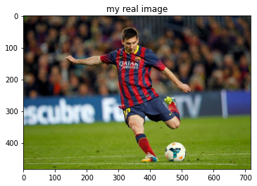
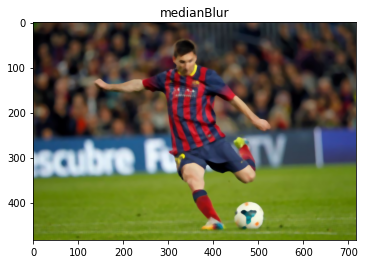
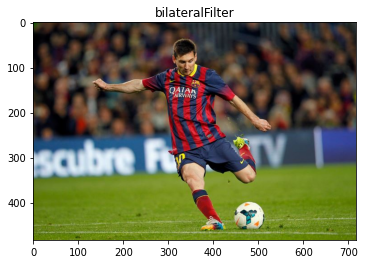

# topics:

- [Qustion 1](#Qustion-1):RGB, HSV and CMYK
    - [CMYK and RGB? HSV and HSL? Introducing the Chromatic Compendium!](https://dev.to/r4h33m/cmyk-and-rgb-hsv-and-hsl-introducing-the-chromatic-compendium-1d7)
- [Filter Images](#Filter-Images)
    - why we use fillters? for local process like delete noise with average fillter
- [Types of Convolution Kernels](https://towardsdatascience.com/types-of-convolution-kernels-simplified-f040cb307c37)
- make image blur
----
slides 3 - page 1-9


# Filter Images 


```python
import cv2  
import numpy as np
import matplotlib.pyplot as plt
file_path = 'session_4/messi.jpg'
image = cv2.imread(file_path)

#Create noise in the image by adding random values to each pixel, and display it: 
plt.title('my real image')
plt.imshow(image[:,:,[2,1,0]]) # make it RGB
plt.show()

#Apply GaussianBlur to the noisy image and show the result:
plt.title('GaussianBlur')
gauss_blur = cv2.GaussianBlur(image, (7, 7), 0)
plt.imshow(gauss_blur[:, :, [2, 1, 0]])
plt.show()

#Apply median filtering:
plt.title('medianBlur')
median_blur = cv2.medianBlur(image, 7)
plt.imshow(median_blur[:, :, [2, 1, 0]])
plt.show()

#Perform median filtration to our image with noise:
plt.title('bilateralFilter')
bilat = cv2.bilateralFilter(image, -1, 0.3, 10)
plt.imshow(bilat[:, :, [2, 1, 0]])
plt.show()
```










