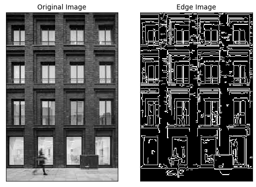

# topics:
- project and add store text for ocr
- Fliter Images recap
- [Image Gradients](#Image-Gradients)
    - [gradients doc](https://opencv-python-tutroals.readthedocs.io/en/latest/py_tutorials/py_imgproc/py_gradients/py_gradients.html)
- [Canny edge detection algorithm](#Canny-edge-detection-algorithm)
    - [Doc](https://opencv-python-tutroals.readthedocs.io/en/latest/py_tutorials/py_imgproc/py_canny/py_canny.html)
----
slides 3


```python
import cv2  
import numpy as np
import matplotlib.pyplot as plt
from matplotlib.pyplot import figure

```


# Image Gradients
- cv2.Sobel
- cv2.Scharr
- cv2.Laplacian


```python

```


```python
img = cv2.imread('session_5/building.jpg' , 0)
laplacian = cv2.Laplacian(img,cv2.CV_64F)
sobelx = cv2.Sobel(img,cv2.CV_64F,1,0,ksize=5)
sobely = cv2.Sobel(img,cv2.CV_64F,0,1,ksize=5)
scharrx = cv2.Scharr(img,cv2.CV_64F,1,0)
scharry = cv2.Scharr(img,cv2.CV_64F,0,1)


figure(figsize=(8, 10), dpi=80)
plt.subplot(2,3,1),plt.imshow(img,cmap = 'gray')
plt.title('Original'), plt.xticks([]), plt.yticks([])
plt.subplot(2,3,2),plt.imshow(laplacian,cmap = 'gray')
plt.title('Laplacian'), plt.xticks([]), plt.yticks([])
plt.subplot(2,3,3),plt.imshow(sobelx,cmap = 'gray')
plt.title('Sobel X'), plt.xticks([]), plt.yticks([])
plt.subplot(2,3,4),plt.imshow(sobely,cmap = 'gray')
plt.title('Sobel Y'), plt.xticks([]), plt.yticks([])

plt.subplot(2,3,5),plt.imshow(scharrx,cmap = 'gray')
plt.title('Scharr X'), plt.xticks([]), plt.yticks([])
plt.subplot(2,3,6),plt.imshow(scharry,cmap = 'gray')
plt.title('Scharr Y'), plt.xticks([]), plt.yticks([])

plt.show()

```


## Canny edge detection algorithm


```python
figure(figsize=(8, 10), dpi=80)

img = cv2.imread('session_5/building.jpg',0)
edges = cv2.Canny(img,100,200)

plt.subplot(121),plt.imshow(img,cmap = 'gray')
plt.title('Original Image'), plt.xticks([]), plt.yticks([])
plt.subplot(122),plt.imshow(edges,cmap = 'gray')
plt.title('Edge Image'), plt.xticks([]), plt.yticks([])

plt.show()
```




