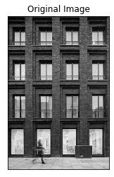
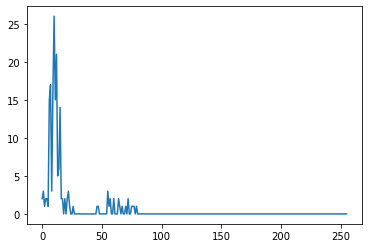
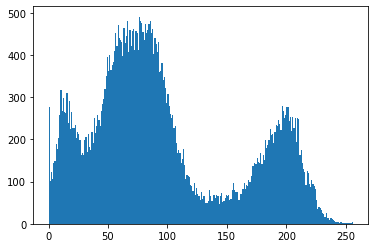
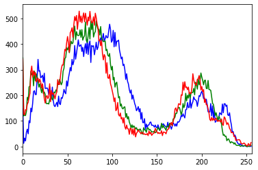
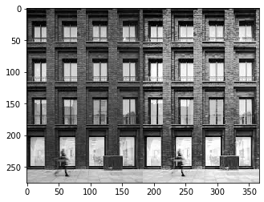
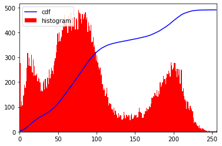

# topics:
- [filter2D](#filter2D)
- Image Histogram
    - [cv.calcHist](#cv.calcHist)
        - [Histograms Docs ](https://docs.opencv.org/master/d1/db7/tutorial_py_histogram_begins.html)
    
    - [cv2.equalizeHist](#cv2.equalizeHist)
        - [histogram_equaliz docs](https://docs.opencv.org/master/d5/daf/tutorial_py_histogram_equalization.html)

---

- [Image Gradients](#Image-Gradients)
    - [gradients doc](https://opencv-python-tutroals.readthedocs.io/en/latest/py_tutorials/py_imgproc/py_gradients/py_gradients.html)
- [Canny edge detection algorithm](#Canny-edge-detection-algorithm)
    - [Doc](https://opencv-python-tutroals.readthedocs.io/en/latest/py_tutorials/py_imgproc/py_canny/py_canny.html)
----
slides 3


```python
import cv2  
import numpy as np
import matplotlib.pyplot as plt
from matplotlib.pyplot import figure

```


## filter2D


```python
file_name = 'session_6/building.jpg'
img = cv2.imread(file_name , 0)
plt.imshow(img,cmap = 'gray')
plt.title('Original Image'), plt.xticks([]), plt.yticks([])
plt.show()
```





# cv2.calcHist


```python
# hist is a 256x1 array, each value corresponds to number of pixels in that image with its corresponding pixel value.
hist = cv2.calcHist(img, [0],None,[256],[0,256])
plt.plot(np.arange(256), hist, )
plt.show()
```





histogram with plt.hist


```python
plt.hist(img.ravel() ,256,[0,256]); plt.show()
```





histogram with plt.hist and multi channel


```python
img = cv2.imread(file_name)
color = ('b','g','r')
for i,col in enumerate(color):
    histr = cv2.calcHist([img],[i],None,[256],[0,256])
    plt.plot(histr,color = col)
    plt.xlim([0,256])
plt.show()
```





## cv2.equalizeHist


```python
img = cv2.imread(file_name, 0)
equ = cv2.equalizeHist(img)
res = np.hstack((img,equ)) 
plt.imshow(res,cmap = 'gray')
plt.show
```


    <function matplotlib.pyplot.show(*args, **kw)>





```python
img = cv2.imread(file_name,0)
hist,bins = np.histogram(img.flatten(),256,[0,256])
cdf = hist.cumsum()
cdf_normalized = cdf * float(hist.max()) / cdf.max()
plt.plot(cdf_normalized, color = 'b')
plt.hist(img.flatten(),256,[0,256], color = 'r')
plt.xlim([0,256])
plt.legend(('cdf','histogram'), loc = 'upper left')
plt.show()
```




