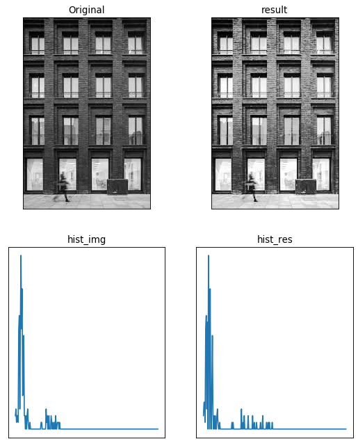
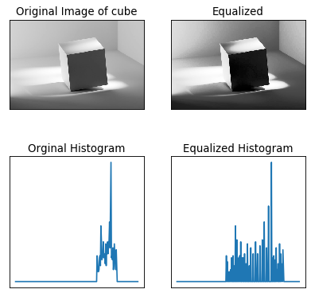
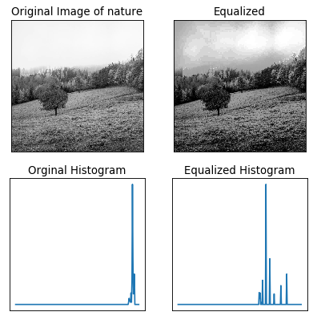
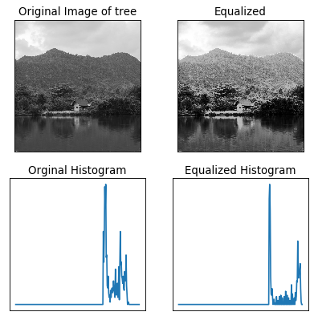
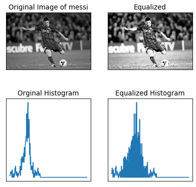
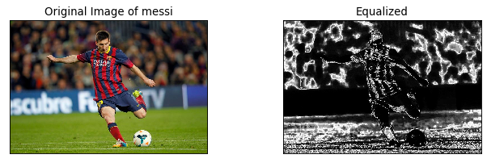
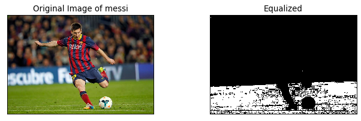

# topics:
- [cv2.equalizeHist](#cv2.equalizeHistb)
    - [equalized Image vs Orginal](#equalized-Image-vs-Orginal)
    - [histogram_equaliz docs](https://docs.opencv.org/master/d5/daf/tutorial_py_histogram_equalization.html)


- [cv2.compareHist](#cv2.compareHist)
     - [Histogram Comparison docs](https://docs.opencv.org/3.4/d8/dc8/tutorial_histogram_comparison.html)
 
 
 - [cv2.calcBackProject](#cv2.calcBackProject)
     - [Back Projection docs](https://docs.opencv.org/3.4/da/d7f/tutorial_back_projection.html)
 


----
slide 4


# cv2.equalizeHistb


```python
import cv2  
import numpy as np
import matplotlib.pyplot as plt
from matplotlib.pyplot import figure
file_name = 'session_7/building.jpg'
```


```python
img = cv2.imread(file_name, 0)
equ = cv2.equalizeHist(img)
res = np.hstack((img,equ)) 
hist_img = cv2.calcHist(img, [0],None,[256],[0,256])
hist_res = cv2.calcHist(equ, [0],None,[256],[0,256])

```

## equalized Image vs Orginal


```python
figure(figsize=(8, 10), dpi=80)
plt.subplot(2,2,1),plt.imshow(img,cmap = 'gray')
plt.title('Original'), plt.xticks([]), plt.yticks([])
plt.subplot(2,2,2),plt.imshow(equ,cmap = 'gray')
plt.title('equalized'), plt.xticks([]), plt.yticks([])
plt.subplot(2,2,3), plt.plot(np.arange(256), hist_img, )
plt.title('hist_img'), plt.xticks([]), plt.yticks([])
plt.subplot(2,2,4),plt.plot(np.arange(256), hist_res, )
plt.title('hist_res'), plt.xticks([]), plt.yticks([])
plt.show()
```





## on diffrent image


```python
files= {
    'car':'session_7/car.jpg',
    'cube':'session_7/cube.jpg',
    'nature':'session_7/nature.jpg',
    'tree':'session_7/tree.jpg',
    'messi':'session_7/messi.jpg',
    
}
for image_name , image_path in files.items():
    img = cv2.imread(image_path, 0)
    equ = cv2.equalizeHist(img)
    res = np.hstack((img,equ)) 
    hist_img = cv2.calcHist(img, [0],None,[256],[0,256])
    hist_res = cv2.calcHist(equ, [0],None,[256],[0,256])
    
    figure(figsize=(6, 6), dpi=80)
    plt.subplot(2,2,1),plt.imshow(img,cmap = 'gray')
    plt.title(f'Original Image of {image_name}'), plt.xticks([]), plt.yticks([])
    plt.subplot(2,2,2),plt.imshow(equ,cmap = 'gray')
    plt.title('Equalized'), plt.xticks([]), plt.yticks([])
    plt.subplot(2,2,3), plt.plot(np.arange(256), hist_img, )
    plt.title('Orginal Histogram'), plt.xticks([]), plt.yticks([])
    plt.subplot(2,2,4),plt.plot(np.arange(256), hist_res, )
    plt.title('Equalized Histogram'), plt.xticks([]), plt.yticks([])
    plt.show()

    

```














# cv2.compareHist

## `methods:` 
```
cv2.HISTCMP_CORREL
cv2.HISTCMP_CHISQR/ cv2.HISTCMP_CHISQR_ALT
cv2.HISTCMP_INTERSECT
cv2.HISTCMP_BHATTACHARYYA
```


```python

img_1 = cv2.imread(files['nature'])
img_2 = cv2.imread(files['car'])
hist_1 = cv2.calcHist(img_1, [0],None,[256],[0,256])
hist_2 = cv2.calcHist(img_2, [0],None,[256],[0,256])

cv2.compareHist(hist_1, hist_2, cv2.HISTCMP_CORREL)
```


    -0.06754886844576494


<div dir="rtl">
 تمرین احتمالی
مجموعه تصاویر دادن بهمون که این مجموع تصاویر مربوط به فصل های مختلف سال هستند. این تصاویر بدون هیچ ترتیب خاصی وجود دارند.
حالا یک تصویر جدید رو به شما میدن از شما میخوان میخوان که شباهت تصویری که دارید با کدوم یکی از تصاویر مجموع شبیه تر هستش؟
    
</div>

# cv2.calcBackProject


```python
img = cv2.imread(files['messi'])
hist = cv2.calcHist([img[400: , :100]], [0], None, [256], [0,256])

```





```python
img = cv2.imread(files['messi'])
roi = img[400:450 , 50:250]

roi_hsv = cv2.cvtColor(img[400:450 , 50:250], cv2.COLOR_BGR2HSV)
img_hsv = cv2.cvtColor(img, cv2.COLOR_BGR2HSV)
roi_hist = cv2.calcHist([roi_hsv], [0,1], None, [180,256], [0,180 , 0,256])

cv2.normalize(roi_hist,roi_hist, alpha=0, beta=255, norm_type=cv2.NORM_MINMAX)

backproj = cv2.calcBackProject([img_hsv], [0,1], roi_hist,  [0,180 , 0,256], scale=1)
ret , dst = cv2.threshold(backproj,10,255,cv2.THRESH_BINARY)


figure(figsize=(10, 6), dpi=80)
plt.subplot(2,2,1),plt.imshow(img[:,:,::-1],cmap = 'gray')
plt.title(f'Original Image of messi'), plt.xticks([]), plt.yticks([])
plt.subplot(2,2,2),plt.imshow(dst,cmap = 'gray')
plt.title('Equalized'), plt.xticks([]), plt.yticks([])
plt.show()
```




