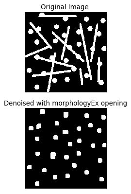

# topics:
- [cv2.morphologyEx](#cv2.morphologyEx)
  
    - [Morphological Transformations docs](https://opencv-python-tutroals.readthedocs.io/en/latest/py_tutorials/py_imgproc/py_morphological_ops/py_morphological_ops.html)


----
slide 4


```python
import cv2  
import numpy as np
import matplotlib.pyplot as plt
from matplotlib.pyplot import figure
```

# cv2.morphologyEx


```python
img = cv2.imread('session_8/test.png',0)
kernel = np.ones((7,7),np.uint8)
opening = cv2.morphologyEx(img, cv2.MORPH_OPEN, kernel)
dst     = cv2.morphologyEx(opening, cv2.MORPH_CLOSE, kernel)


figure(figsize=(6, 6), dpi=80)
plt.subplot(2,1,1),plt.imshow(img,cmap = 'gray')
plt.title(f'Original Image '), plt.xticks([]), plt.yticks([])
plt.subplot(2,1,2),plt.imshow(dst,cmap = 'gray')
plt.title('Denoised with morphologyEx opening and closing'), plt.xticks([]), plt.yticks([])
plt.show()
```


    ---------------------------------------------------------------------------

    NameError                                 Traceback (most recent call last)

    <ipython-input-4-6e36eeb588d4> in <module>
    ----> 1 img = cv2.imread('session_8/test.png',0)
          2 kernel = np.ones((7,7),np.uint8)
          3 opening = cv2.morphologyEx(img, cv2.MORPH_OPEN, kernel)
          4 dst     = cv2.morphologyEx(opening, cv2.MORPH_CLOSE, kernel)
          5 


    NameError: name 'cv2' is not defined


```python
kernel = np.ones((10,10),np.uint8)
kernel[0,0]=kernel[9,0]=kernel[0,9]=kernel[9,9]=0

img = cv2.imread('session_8/art3.jpg',0)
dst2 = cv2.morphologyEx(img, cv2.MORPH_OPEN, kernel, iterations=1)

figure(figsize=(6, 6), dpi=80)
plt.subplot(2,1,1),plt.imshow(img,cmap = 'gray')
plt.title(f'Original Image '), plt.xticks([]), plt.yticks([])
plt.subplot(2,1,2),plt.imshow(dst2,cmap = 'gray')
plt.title('Denoised with morphologyEx opening'), plt.xticks([]), plt.yticks([])
plt.show()
```





```python
img = cv2.imread('test.png',0)
cv2.imshow('img',img)
kernel = np.ones((7,7),np.uint8)

opening = cv2.morphologyEx(img, cv2.MORPH_OPEN, kernel)
dst     = cv2.morphologyEx(opening, cv2.MORPH_CLOSE, kernel)

cv2.imshow('dst',dst)

img2 = cv2.imread('art3.jpg',0)
cv2.imshow('img2',img2)
kernel = np.ones((10,10),np.uint8)
kernel[0,0]=kernel[9,0]=kernel[0,9]=kernel[9,9]=0

dst2 = cv2.morphologyEx(img2, cv2.MORPH_OPEN, kernel)


cv2.imshow('dst2',dst2)

```
